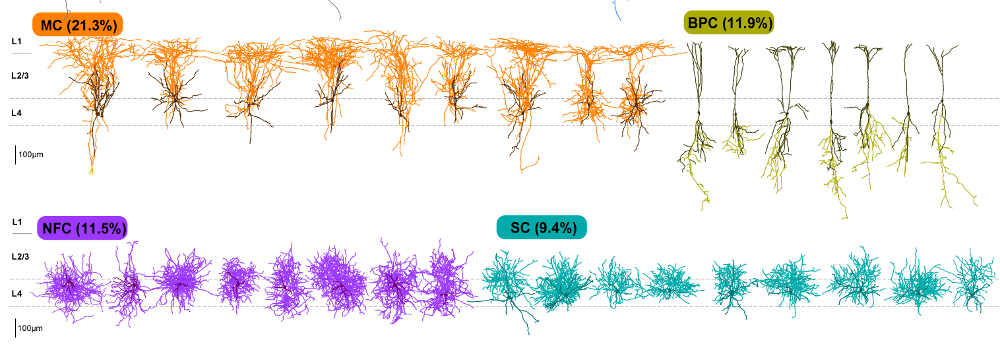

# Neocortical layer 4 in adult mouse differs in major cell types and circuit organization between primary sensory areas

Analysis code for the L4 paper

https://www.biorxiv.org/content/10.1101/507293v2
